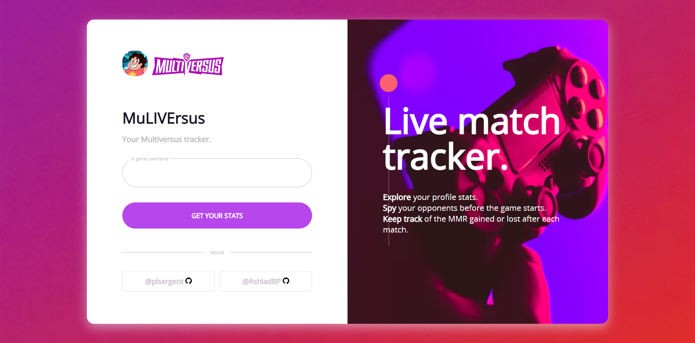
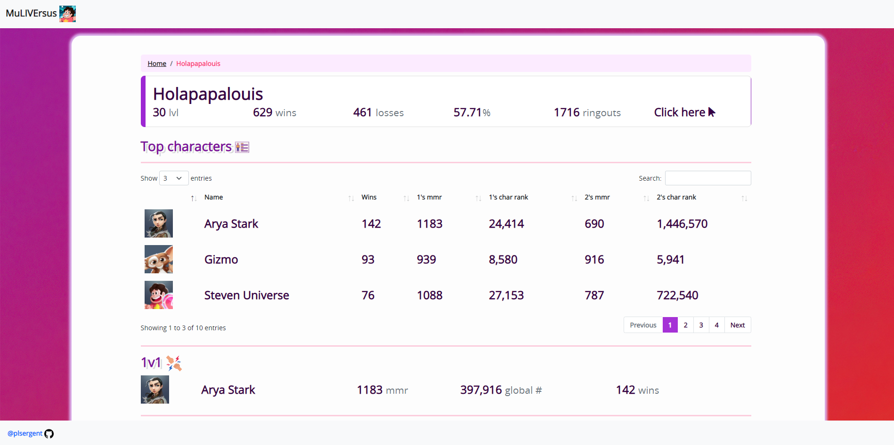
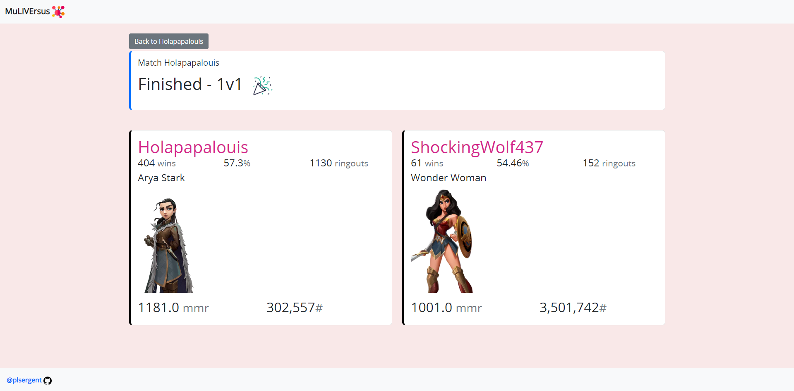

# MuLIVErsus
Web app to display player stats (tracker) and live match data. Allows you to get infos about your opponent(s) and your team before the match.

## Setup

Get a steam token from **[HERE](https://github.com/brianbaldner/multiversus-api-docs/tree/main/steam-ticket-generator)** and put it in the `config.json` file.

```
poetry install
mv config.yml .config.yml
cd app/
poetry run uvicorn main:app
```

## Screen





## API
I used the following repo [MulpyVersus](https://github.com/AshladBP/MulpyVersus) to make the APIs call with some modification.

***Disclaimer: the API is unofficial.***