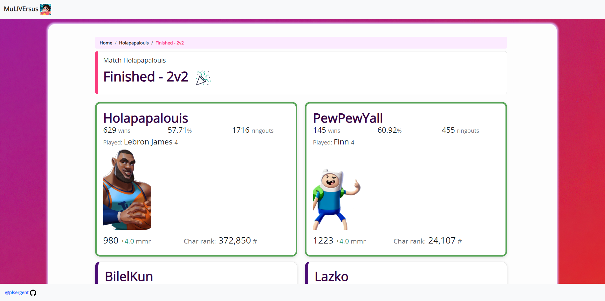

# MuLIVErsus
Web app to display player stats (tracker) and live match data. Allows you to get infos about your opponent(s) and your team before the match.

## End of project

The open beta [has been closed by WB](https://multiversus.com/fr/faq). The app is not working anymore. See you in 2024!

## Setup

Get a steam token from **[HERE](https://github.com/brianbaldner/multiversus-api-docs/tree/main/steam-ticket-generator)** and put it in the `app/config.yml` file. 

***If you want to use the app while playing the game you'll need to generate a token with an other account. For the token to be generated you'll need to login once into the game and link your steam account to a new WB account.***

Local run:
```
poetry install
mv config.yml .config.yml
poetry run uvicorn app.main:app --reload
```

## Screen




## API
I used the following repo [MulpyVersus](https://github.com/AshladBP/MulpyVersus) to make the APIs call with some modifications.

***Disclaimer: the API is unofficial.***
